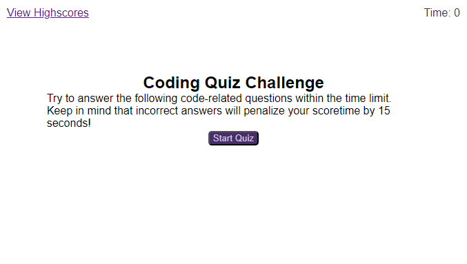

# JavaScript_Quiz
Webpage for timed quiz on fundamentals of JavaScript

## Description

JavaScript Quiz webpage was created for UCF bootcamp class as a webpage for quizing user on their knowledge of basic JavaScript questions. The user will go through the questions and record their name and time, to be added to local storage and printed on high score webpage. The webpage was designed to go along with learning and display student ability to utilize knowledge on JavaScript and timers specifically.

## Installation

N/A

## Usage

To use the JavaScript Quiz page, load webpage and click the button titled "Start Quiz". When the button is clicked, a question with answer choices will appear. After the question is answered, more questions will appear one at a time until all are answered, or the time runs out. Once the quiz ends, a page that asks for the users initials will appear. Typing initials and hitting submit will save the initials and score in local storage.

A page showing the top 10 scores saved will appear after submitting initials, but can also be viewed by clicking the "View Highscores" button at the top left of the page.

Link to the webpage: [JavaScript Quiz](https://sienkc.github.io/JavaScript_Quiz/index.html)

Screenshot with generated random password:

## Credits

Project idea provided by the boot camp creators [UCF Boot Camps](https://bootcamp.ce.ucf.edu/).

Shuffle method used in JavaScript is based on Fisher-Yates method named after Ronald Fisher and Frank Yates. 

## License

Licensed under [MIT](LICENSE)
